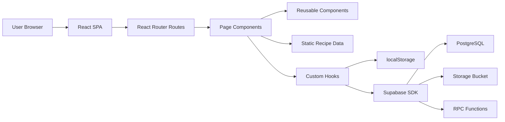
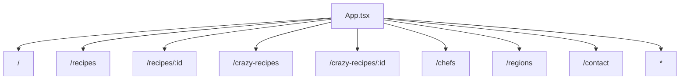
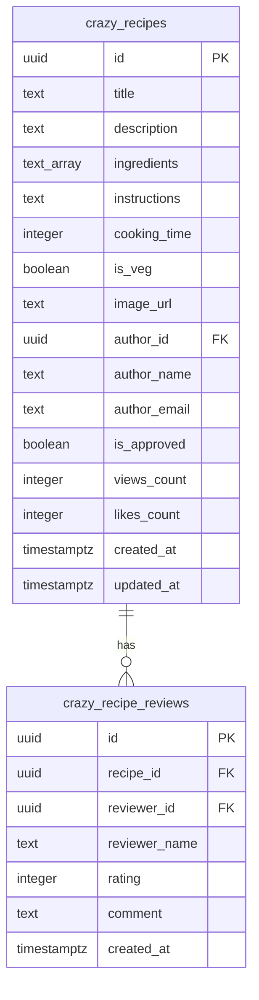

# AHARA Architecture

AHARA is a client-rendered Vite application with optional Supabase-backed data operations.

## System Overview

## Frontend Layers

| Layer | Location | Responsibility |
| --- | --- | --- |
| Entry | `src/main.tsx` | Mounts the React app. |
| App shell | `src/App.tsx` | Providers, routing, lazy-loaded pages, global toasts. |
| Pages | `src/pages/` | Route-level UI. |
| Components | `src/components/` | Reusable app components and `ui/` primitives. |
| Hooks | `src/hooks/` | UI state, persistence, language, dark mode, Supabase adapters. |
| Data | `src/data/` | Static recipes, recipe details, weird foods, reviews, chefs, regions. |
| Services | `src/services/` | Supabase data and storage operations. |
| Integrations | `src/integrations/supabase/` | Supabase client and generated database types. |

## Routing

## Data Model

Traditional recipes are static TypeScript objects. Fusion recipes have both static local data and Supabase-backed service operations.

## Supabase Capabilities

The migrations define:

- `crazy_recipes`
- `crazy_recipe_reviews`
- Row Level Security policies
- indexes for author, approval state, created date, recipe reviews, and reviewer IDs
- RPC functions for view and like counters
- a `crazy-recipe-images` storage bucket
- account deletion helper functions

## Current Architecture Gaps

- No custom backend server or REST API exists.
- No automated tests are configured.
- Some Supabase write flows exist in `recipeService.ts` but are disabled in `useRecipeService.ts`.
- Production deployment details are not pinned to a specific platform.
- Supabase local development commands are not documented in existing scripts.
