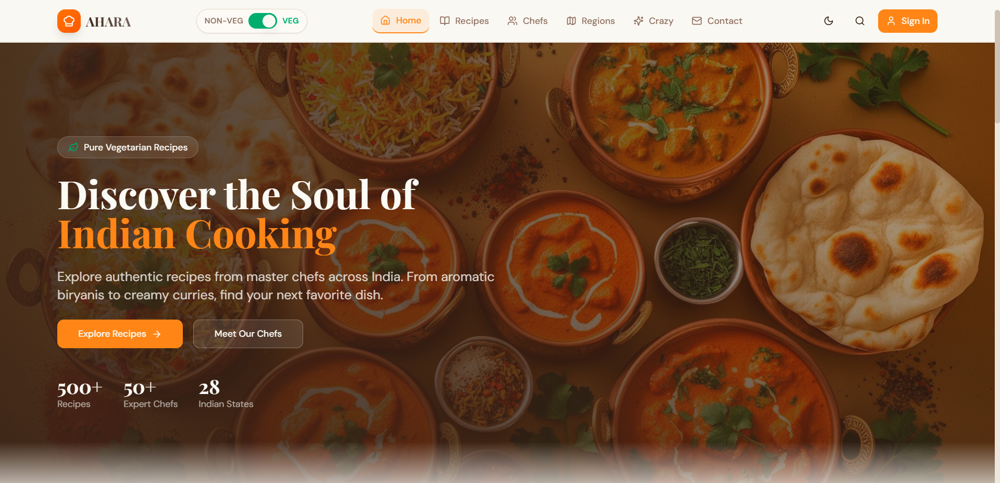
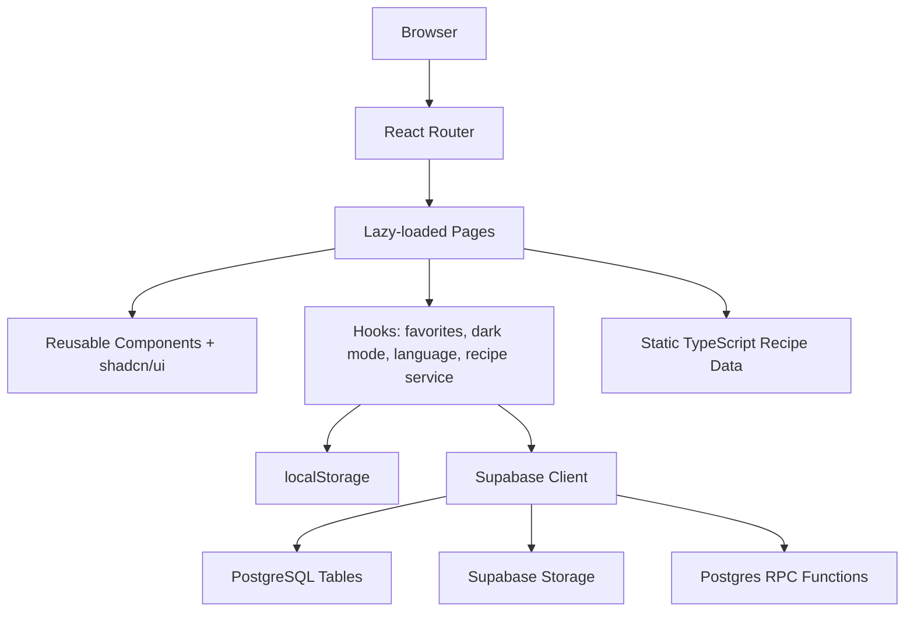

# AHARA


AHARA is a polished React and TypeScript recipe discovery app for Indian cuisine, combining curated regional recipes with a playful "crazy recipes" collection of experimental fusion dishes.



Live site: [aharaa.in](https://aharaa.in)

## Project Analysis Summary

AHARA is a Vite single-page application using React 18, TypeScript, Tailwind CSS, Radix UI primitives, shadcn/ui-style components, React Router, TanStack React Query, and optional Supabase integration. Traditional recipes, chef profiles, and regions are stored in local TypeScript data files. Fusion recipe workflows are backed by Supabase tables, RPC functions, storage buckets, and migrations, although several create/update/delete/review submission flows are currently disabled in the UI hook layer.

Verified repository characteristics:

- **Purpose:** Browse Indian recipes, explore chef profiles and regions, and view experimental fusion recipes.
- **Frontend:** Lazy-loaded React routes, local state hooks, dark mode, language context, responsive Tailwind UI.
- **Backend/data:** Static recipe data plus optional Supabase `crazy_recipes`, `crazy_recipe_reviews`, storage, and RPC functions.
- **Build system:** Vite with manual Rollup chunks and GitHub Actions build matrix for Node 18, 20, and 22.
- **Testing:** No test script or test suite is currently configured in `package.json`.
- **Deployment:** Static-site deployment via `npm run build`; Netlify SPA fallback exists in `public/_redirects`.
- **Missing documentation areas:** Formal API contract, test strategy, production Supabase setup, accessibility policy, release process, and environment-specific deployment runbooks.

## Contents

- [Features](#features)
- [Overview](#overview)
- [Architecture](#architecture)
- [Tech Stack](#tech-stack)
- [Installation](#installation)
- [Configuration](#configuration)
- [Quick Start](#quick-start)
- [Project Structure](#project-structure)
- [Development Workflow](#development-workflow)
- [Testing](#testing)
- [API Documentation](#api-documentation)
- [Security](#security)
- [Deployment](#deployment)
- [Performance](#performance)
- [Contributing](#contributing)
- [Roadmap](#roadmap)
- [FAQ](#faq)
- [License](#license)

## Features

- 🍛 Browse 59 curated Indian recipes across regions including Punjab, Hyderabad, Karnataka, Tamil Nadu, Goa, Delhi, Gujarat, Kerala, and Rajasthan.
- 🔎 Search and filter recipes by region, diet type, spice level, and cooking time.
- 🧑‍🍳 Explore chef profiles with specialties, ratings, followers, recipe counts, and verification badges.
- 🧪 View 15 fusion recipes such as Chocolate Samosa, Pizza Dosa, Chai Pasta, Burger Biryani, and Mutton Cake.
- ❤️ Save favorite recipes in the browser through `localStorage`.
- 🌗 Toggle light and dark themes.
- 🌐 Use a language context for localized UI strings.
- ⚡ Load routes lazily for better initial page performance.
- 🧰 Connect optional Supabase-backed fusion recipe data, storage, review, like, and view-count flows.

## Overview

AHARA is designed as a modern recipe browsing experience for Indian food discovery. The primary recipe catalog is local and deterministic, making the app usable without a database connection. Supabase support adds a backend path for fusion recipes, reviews, storage-backed images, and recipe engagement counters.

The app exposes these client routes:

| Route | Purpose |
| --- | --- |
| `/` | Home and recipe discovery entry point |
| `/recipes` | Traditional recipe browser |
| `/recipes/:id` | Traditional recipe detail page |
| `/crazy-recipes` | Fusion recipe browser |
| `/crazy-recipes/:id` | Fusion recipe detail page |
| `/chefs` | Chef profile listing |
| `/regions` | Regional cuisine exploration |
| `/contact` | Contact page |
| `*` | Not-found route |

## Architecture



<details>
<summary>Architecture notes</summary>

- `src/App.tsx` defines the route map and wraps the app with `HelmetProvider`, `DarkModeProvider`, `LanguageProvider`, `QueryClientProvider`, and UI providers.
- `src/data/recipes.ts`, `src/data/recipeDetails.ts`, and `src/data/weirdFoods.ts` contain local catalog data.
- `src/services/recipeService.ts` contains Supabase SDK operations for `crazy_recipes`, review reads, storage image operations, stats, likes, and views.
- `src/hooks/useRecipeService.ts` adapts service calls for UI use and currently disables user submissions, edits, deletes, and review submissions with toast messages.
- `supabase/migrations/` contains SQL for tables, RLS policies, storage buckets, RPC functions, and account-deletion helpers.

</details>

## Tech Stack

| Category | Technology |
| -------- | ---------- |
| Frontend | React 18, TypeScript, Vite |
| Routing | React Router DOM |
| Styling | Tailwind CSS, tailwindcss-animate, CSS variables |
| UI | Radix UI primitives, shadcn/ui-style components, Lucide React |
| State/Data | TanStack React Query, custom hooks, localStorage |
| Backend | Optional Supabase client SDK |
| Database | PostgreSQL through Supabase migrations |
| Storage | Supabase Storage bucket for fusion recipe images |
| Animation | Framer Motion, Motion, GSAP |
| Build | Vite, React SWC plugin, Rollup manual chunks |
| CI/CD | GitHub Actions build workflow |

## Installation

### Prerequisites

- Node.js 18 or newer
- npm
- Optional: Supabase CLI for local database work or migration deployment

### Clone and install

```bash
git clone https://github.com/VarunB453/AHARA.git
cd AHARA
npm install
```

## Configuration

Supabase configuration is optional for local UI development. Without it, the client falls back to placeholder values and logs a warning; database-backed fusion recipe features will not work against a real backend until valid values are supplied.

Create `.env.local`:

```env
VITE_SUPABASE_URL=https://your-project.supabase.co
VITE_SUPABASE_ANON_KEY=your-anon-key
```

| Variable | Required | Description |
| -------- | -------- | ----------- |
| `VITE_SUPABASE_URL` | Required for Supabase features | Supabase project URL. |
| `VITE_SUPABASE_ANON_KEY` | Required for Supabase features | Public anon key used by the browser client. |
| `VITE_SUPABASE_PUBLISHABLE_DEFAULT_KEY` | Optional fallback | Alternate anon key variable checked by the client. |
| `VITE_SUPABASE_PUBLIC_ANON_KEY` | Optional fallback | Alternate anon key variable checked by the client. |

## Quick Start

```bash
npm install
npm run dev
```

The Vite dev server is configured for:

```text
http://localhost:8080
```

## Project Structure

```text
AHARA/
|-- .github/workflows/       # GitHub Actions build workflow
|-- docs/                    # Existing long-form documentation
|-- public/                  # Static assets, favicon, Netlify redirects, fusion food images
|-- src/
|   |-- assets/              # Bundled image assets
|   |-- components/          # App components and UI primitives
|   |-- data/                # Static recipe, detail, chef, region, and fusion recipe data
|   |-- hooks/               # UI and state hooks
|   |-- integrations/        # Supabase generated client/types
|   |-- lib/                 # Utilities and animation helpers
|   |-- pages/               # Route-level React pages
|   |-- services/            # Supabase recipe service operations
|   |-- App.tsx              # Provider setup and route map
|   |-- main.tsx             # React entry point
|-- supabase/
|   |-- config.toml          # Supabase project config placeholder
|   |-- migrations/          # SQL migrations for tables, RLS, storage, and RPC functions
|-- package.json             # Scripts and dependencies
|-- tailwind.config.ts       # Tailwind theme configuration
|-- vite.config.ts           # Vite server, aliases, and chunking
```

## Development Workflow

| Task | Command | Notes |
| --- | --- | --- |
| Install dependencies | `npm install` | Uses `package-lock.json`. A `bun.lockb` is also present, but npm is the documented workflow. |
| Run dev server | `npm run dev` | Starts Vite on port `8080`. |
| Build production assets | `npm run build` | Emits static assets to `dist/`. |
| Build development mode | `npm run build:dev` | Runs Vite build with development mode. |
| Preview production build | `npm run preview` | Serves the built `dist/` output locally. |
| Lint | `npm run lint` | Runs ESLint over the repository. |
| Format | Not configured | Add Prettier or a formatter script before documenting a command. |
| Test | Not configured | Add a test runner before documenting a command. |

## Testing

No formal test suite is currently configured. `package.json` does not include a `test` script, and the repository does not include Vitest, Jest, React Testing Library, or Playwright test files.

Recommended testing additions:

- Unit tests for `src/lib/*`, `src/hooks/*`, and pure data helpers.
- Component tests for `RecipeCard`, `FilterSection`, `Navbar`, `LikeButton`, and route pages.
- Integration tests for Supabase service functions with mocked Supabase clients.
- End-to-end tests for recipe browsing, filtering, favorites, theme switching, and route fallback behavior.

## API Documentation

AHARA does not define a custom server API in this repository. Backend operations use the Supabase JavaScript SDK directly from the frontend.

Verified Supabase-backed operations include:

| Operation | Supabase target | Source |
| --- | --- | --- |
| List fusion recipes | `crazy_recipes` table | `getAllRecipes()` |
| Read fusion recipe by ID | `crazy_recipes` table | `getRecipeById(id)` |
| Search fusion recipes | `crazy_recipes` table | `searchRecipes(searchTerm)` |
| Filter by vegetarian status | `crazy_recipes` table | `filterRecipesByType(isVeg)` |
| Read reviews | `crazy_recipe_reviews` table | `getRecipeReviews(recipeId)` |
| Upload recipe image | `crazy-recipe-images` bucket | `createRecipeWithImage()` / `updateRecipeWithImage()` |
| Increment views | `increment_recipe_views` RPC | `incrementRecipeViews(recipeId)` |
| Increment likes | `increment_recipe_likes` RPC | `incrementRecipeLikes(recipeId)` |
| Decrement likes | `decrement_recipe_likes` RPC | `decrementRecipeLikes(recipeId)` |

See [API.md](API.md) for a fuller client API map.

## Security

- 🔒 Keep Supabase anon keys public-only and enforce access through Row Level Security.
- 🧾 Do not commit `.env.local` or service-role keys.
- 🛡 Review Supabase RLS policies before enabling user submissions in production.
- 🧼 Validate and sanitize user-provided recipe fields before re-enabling writes.
- 🖼 Restrict storage uploads by MIME type and size; migrations include a storage bucket setup.
- 🌐 Configure production hosts with HTTPS, secure headers, and SPA fallback routing.

See [SECURITY.md](SECURITY.md) for detailed recommendations.

## Deployment

Build the static application:

```bash
npm run build
```

Deploy the generated `dist/` directory to a static hosting provider such as Netlify, Vercel, Cloudflare Pages, or GitHub Pages. For client-side routing, configure all unknown routes to serve `index.html`. A Netlify-compatible fallback already exists:

```text
public/_redirects
```

GitHub Actions currently verifies builds on pushes and pull requests to `main` across Node 18, 20, and 22. It does not currently deploy the app.

See [DEPLOYMENT.md](DEPLOYMENT.md) for deployment notes and missing production details.

## Performance

Current performance-oriented implementation details:

- Lazy-loaded route pages via `React.lazy` and `Suspense`.
- Manual Vite/Rollup chunks for vendor, Radix, Supabase, router, and UI dependencies.
- Static recipe data for fast catalog rendering without mandatory backend round trips.
- Local browser persistence for favorites, language, and theme preferences.

Recommended improvements:

- Audit remote image usage and add optimized local/CDN image variants.
- Add Lighthouse budgets and Core Web Vitals tracking.
- Add bundle analysis to watch dependency growth.
- Add skeleton states for Supabase-backed recipe lists where needed.

## Contributing

Contributions should follow the documented workflow in [CONTRIBUTING.md](CONTRIBUTING.md). The repository also includes an existing [CONTRIBUTE.md](CONTRIBUTE.md) file with extended contribution guidance.

## Roadmap

- [ ] Add a formal test suite and CI test step.
- [ ] Add production Supabase setup documentation with migration commands.
- [ ] Reconcile disabled user submission/review flows with database capabilities.
- [ ] Add accessibility checks and route-level SEO metadata coverage.
- [ ] Add API contract documentation generated from Supabase types.
- [ ] Add release process and semantic changelog workflow.

## FAQ

<details>
<summary>Does the app require Supabase to run locally?</summary>

No. The main UI and static recipe catalog can run without Supabase credentials. Supabase-backed fusion recipe database features require valid environment variables and migrated database objects.

</details>

<details>
<summary>Which package manager should I use?</summary>

Use npm for the documented workflow because `package-lock.json` is present and the scripts are standard npm scripts. A `bun.lockb` file is present, but Bun usage is not documented in project scripts.

</details>

<details>
<summary>Are tests available?</summary>

No formal tests are currently configured. Add a `test` script and test dependencies before treating automated tests as part of the development workflow.

</details>

<details>
<summary>Is there a backend API server?</summary>

No custom backend server exists in this repository. Supabase is accessed directly from the frontend through `@supabase/supabase-js`.

</details>

## Additional Documentation

- [ARCHITECTURE.md](ARCHITECTURE.md)
- [DEVELOPMENT.md](DEVELOPMENT.md)
- [DEPLOYMENT.md](DEPLOYMENT.md)
- [API.md](API.md)
- [SECURITY.md](SECURITY.md)
- [CONTRIBUTING.md](CONTRIBUTING.md)
- [CHANGELOG.md](CHANGELOG.md)

## Documentation Quality Review

| Area | Assessment |
| --- | --- |
| Maturity | Solid project README and supporting docs now exist; production operations and tests need hardening. |
| Missing information | Production host, exact Supabase project setup, release process, owner contacts, accessibility targets, test plan. |
| Suggested diagrams | Data model ERD, route map, deployment topology, Supabase RLS policy diagram. |
| Recommended next step | Add tests and turn the Supabase setup into a reproducible local/prod runbook. |

## Acknowledgements

AHARA builds on React, Vite, TypeScript, Tailwind CSS, Radix UI, shadcn/ui conventions, Supabase, TanStack React Query, Lucide, Framer Motion, GSAP, and the broader open-source web ecosystem.

## License

Licensed under the [Apache License 2.0](LICENSE).
